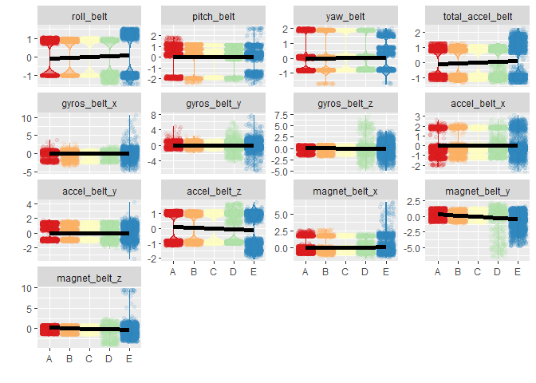
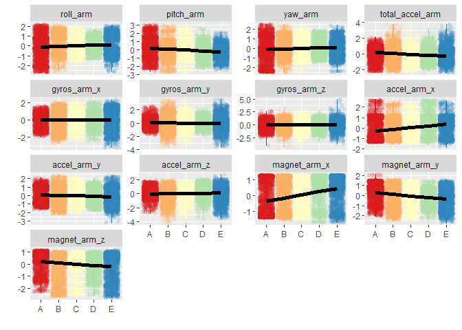
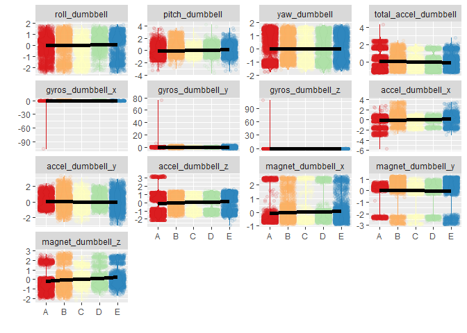

# Course Project Prediction
Kim Rosmus  
January 28, 2018  


## Background:

Using devices such as Jawbone Up, Nike FuelBand, and Fitbit it is now possible to collect a large amount of data about personal activity relatively inexpensively. These type of devices are part of the quantified self movement - a group of enthusiasts who take measurements about themselves regularly to improve their health, to find patterns in their behavior, or because they are tech geeks. One thing that people regularly do is quantify how much of a particular activity they do, but they rarely quantify how well they do it. In this project, your goal will be to use data from accelerometers on the belt, forearm, arm, and dumbell of 6 participants. They were asked to perform barbell lifts correctly and incorrectly in 5 different ways. More information is available from the website here: http://groupware.les.inf.puc-rio.br/har (see the section on the Weight Lifting Exercise Dataset).

## Goal:

The goal of your project is to predict the manner in which they did the exercise. This is the "classe" variable in the training set. You may use any of the other variables to predict with. You should create a report describing how you built your model, how you used cross validation, what you think the expected out of sample error is, and why you made the choices you did. You will also use your prediction model to predict 20 different test cases.

## Data:


```r
library(e1071)
```

```
## Warning: package 'e1071' was built under R version 3.4.3
```

The training data for this project are available here:

https://d396qusza40orc.cloudfront.net/predmachlearn/pml-training.csv

The test data are available here:

https://d396qusza40orc.cloudfront.net/predmachlearn/pml-testing.csv

The data for this project come from this source: http://groupware.les.inf.puc-rio.br/har. If you use the document you create for this class for any purpose please cite them as they have been very generous in allowing their data to be used for this kind of assignment.

## Preparing the data:

**Reading in the training data**


```r
require(data.table)
```

```
## Loading required package: data.table
```

```r
url <- "https://d396qusza40orc.cloudfront.net/predmachlearn/pml-training.csv"
TrainData <- fread(url)
```
**Reading in the testing data**


```r
url <- "https://d396qusza40orc.cloudfront.net/predmachlearn/pml-testing.csv"
TestData <- fread(url)
```
**Using variables that do not have missing values to be the predictors **


```r
Missing <- sapply(TestData, function (x) any(is.na(x) | x == ""))
Predictor <- !Missing & grepl("belt|[^(fore)]arm|dumbbell|forearm", names(Missing))
predCandidates <- names(Missing)[Predictor]
predCandidates
```

```
##  [1] "roll_belt"            "pitch_belt"           "yaw_belt"            
##  [4] "total_accel_belt"     "gyros_belt_x"         "gyros_belt_y"        
##  [7] "gyros_belt_z"         "accel_belt_x"         "accel_belt_y"        
## [10] "accel_belt_z"         "magnet_belt_x"        "magnet_belt_y"       
## [13] "magnet_belt_z"        "roll_arm"             "pitch_arm"           
## [16] "yaw_arm"              "total_accel_arm"      "gyros_arm_x"         
## [19] "gyros_arm_y"          "gyros_arm_z"          "accel_arm_x"         
## [22] "accel_arm_y"          "accel_arm_z"          "magnet_arm_x"        
## [25] "magnet_arm_y"         "magnet_arm_z"         "roll_dumbbell"       
## [28] "pitch_dumbbell"       "yaw_dumbbell"         "total_accel_dumbbell"
## [31] "gyros_dumbbell_x"     "gyros_dumbbell_y"     "gyros_dumbbell_z"    
## [34] "accel_dumbbell_x"     "accel_dumbbell_y"     "accel_dumbbell_z"    
## [37] "magnet_dumbbell_x"    "magnet_dumbbell_y"    "magnet_dumbbell_z"   
## [40] "roll_forearm"         "pitch_forearm"        "yaw_forearm"         
## [43] "total_accel_forearm"  "gyros_forearm_x"      "gyros_forearm_y"     
## [46] "gyros_forearm_z"      "accel_forearm_x"      "accel_forearm_y"     
## [49] "accel_forearm_z"      "magnet_forearm_x"     "magnet_forearm_y"    
## [52] "magnet_forearm_z"
```
**Subsetting the data to include only the preCandiates from above, and the "classe" variable**


```r
varToInclude <- c("classe", predCandidates)
TrainData <- TrainData[, varToInclude, with=FALSE]
dim(TrainData)
```

```
## [1] 19622    53
```

```r
names(TrainData)
```

```
##  [1] "classe"               "roll_belt"            "pitch_belt"          
##  [4] "yaw_belt"             "total_accel_belt"     "gyros_belt_x"        
##  [7] "gyros_belt_y"         "gyros_belt_z"         "accel_belt_x"        
## [10] "accel_belt_y"         "accel_belt_z"         "magnet_belt_x"       
## [13] "magnet_belt_y"        "magnet_belt_z"        "roll_arm"            
## [16] "pitch_arm"            "yaw_arm"              "total_accel_arm"     
## [19] "gyros_arm_x"          "gyros_arm_y"          "gyros_arm_z"         
## [22] "accel_arm_x"          "accel_arm_y"          "accel_arm_z"         
## [25] "magnet_arm_x"         "magnet_arm_y"         "magnet_arm_z"        
## [28] "roll_dumbbell"        "pitch_dumbbell"       "yaw_dumbbell"        
## [31] "total_accel_dumbbell" "gyros_dumbbell_x"     "gyros_dumbbell_y"    
## [34] "gyros_dumbbell_z"     "accel_dumbbell_x"     "accel_dumbbell_y"    
## [37] "accel_dumbbell_z"     "magnet_dumbbell_x"    "magnet_dumbbell_y"   
## [40] "magnet_dumbbell_z"    "roll_forearm"         "pitch_forearm"       
## [43] "yaw_forearm"          "total_accel_forearm"  "gyros_forearm_x"     
## [46] "gyros_forearm_y"      "gyros_forearm_z"      "accel_forearm_x"     
## [49] "accel_forearm_y"      "accel_forearm_z"      "magnet_forearm_x"    
## [52] "magnet_forearm_y"     "magnet_forearm_z"
```

```r
TrainData <- TrainData[, classe := factor(TrainData[, classe])]
TrainData[, .N, classe]
```

```
##    classe    N
## 1:      A 5580
## 2:      B 3797
## 3:      C 3422
## 4:      D 3216
## 5:      E 3607
```
**Split data into a 60% train and 40% test**


```r
require(caret)
```

```
## Loading required package: caret
```

```
## Warning: package 'caret' was built under R version 3.4.3
```

```
## Loading required package: lattice
```

```
## Loading required package: ggplot2
```

```
## Warning: package 'ggplot2' was built under R version 3.4.1
```

```r
inTrain <- createDataPartition(TrainData$classe, p=0.6)
DTrain <- TrainData[inTrain[[1]]]
DProbe <- TrainData[-inTrain[[1]]]
```
**Processing Data**

The Train and Probe data will be centered and scale and near zero variance will be checked.


```r
X <- DTrain[, predCandidates, with=FALSE]
preProc <- preProcess(X)
preProc
```

```
## Created from 11776 samples and 52 variables
## 
## Pre-processing:
##   - centered (52)
##   - ignored (0)
##   - scaled (52)
```

```r
XCS <- predict(preProc, X)
DTrainCS <- data.table(data.frame(classe = DTrain[, classe], XCS))

X <- DProbe[, predCandidates, with=FALSE]
XCS <- predict(preProc, X)
DProbeCS <- data.table(data.frame(classe = DProbe[, classe], XCS))

zerovar <- nearZeroVar(DTrainCS, saveMetrics=TRUE)
if (any(zerovar$zerovar)) zerovar else message("No variables with near zero variance")
```

```
## No variables with near zero variance
```
**Examine prediction variables**


```r
histGroup <- function (data, regex) {
  col <- grep(regex, names(data))
  col <- c(col, which(names(data) == "classe"))
  require(reshape2)
  n <- nrow(data)
  DMelted <- melt(data[, col, with=FALSE][, rownum := seq(1, n)], id.vars=c("rownum", "classe"))
  require(ggplot2)
  ggplot(DMelted, aes(x=classe, y=value)) +
    geom_violin(aes(color=classe, fill=classe), alpha=1/2) +              geom_jitter(aes(color=classe, fill=classe), alpha=1/10) +
    geom_smooth(aes(group=1), method="gam", color="black", alpha=1/2,     size=2) +
    facet_wrap(~ variable, scale="free_y") +
    scale_color_brewer(palette="Spectral") +
    scale_fill_brewer(palette="Spectral") +
    labs(x="", y="") +
    theme(legend.position="none")
}
histGroup(DTrainCS, "belt")
```

```
## Loading required package: reshape2
```

```
## Warning: package 'reshape2' was built under R version 3.4.1
```

```
## 
## Attaching package: 'reshape2'
```

```
## The following objects are masked from 'package:data.table':
## 
##     dcast, melt
```

<!-- -->

```r
histGroup(DTrainCS, "[^(fore)]arm")
```

<!-- -->

```r
histGroup(DTrainCS, "dumbbell")
```

<!-- -->

```r
histGroup(DTrainCS, "forearm")
```

<!-- -->
## Prediciton Model

**Random Forest**

Using this method, the sample error should be small. Only 40% of the data will the error be estimate. The error should be lower than 5% to be reasonable.

Paralled clusters and control parameters will be set up.The fit model over the tuning paremetetrs will be completed. 


```r
require(e1071)
require(Parallel)
```

```
## Loading required package: Parallel
```

```
## Warning in library(package, lib.loc = lib.loc, character.only = TRUE,
## logical.return = TRUE, : there is no package called 'Parallel'
```

```r
require(doParallel)
```

```
## Loading required package: doParallel
```

```
## Warning: package 'doParallel' was built under R version 3.4.3
```

```
## Loading required package: foreach
```

```
## Warning: package 'foreach' was built under R version 3.4.3
```

```
## Loading required package: iterators
```

```
## Warning: package 'iterators' was built under R version 3.4.3
```

```
## Loading required package: parallel
```

```r
require(foreach)
require(iterators)

cl <- makeCluster(detectCores() - 1)
registerDoParallel(cl)

ctrl <- trainControl(classProbs=TRUE,
                     savePredictions=TRUE,
                     allowParallel=TRUE)
                     
method <- "rf"
system.time(trainingModel <- train(classe ~ ., data=DTrainCS, method=method)) 
```

```
##    user  system elapsed 
##   47.78    0.35 1494.32
```

```r
stopCluster(cl)
```

**Evaluation of the training and probing set of data**


```r
trainingModel
```

```
## Random Forest 
## 
## 11776 samples
##    52 predictor
##     5 classes: 'A', 'B', 'C', 'D', 'E' 
## 
## No pre-processing
## Resampling: Bootstrapped (25 reps) 
## Summary of sample sizes: 11776, 11776, 11776, 11776, 11776, 11776, ... 
## Resampling results across tuning parameters:
## 
##   mtry  Accuracy   Kappa    
##    2    0.9858308  0.9820811
##   27    0.9872507  0.9838785
##   52    0.9771663  0.9711258
## 
## Accuracy was used to select the optimal model using the largest value.
## The final value used for the model was mtry = 27.
```

```r
hat <- predict(trainingModel, DTrainCS)
confusionMatrix(hat, DTrain[, classe])
```

```
## Confusion Matrix and Statistics
## 
##           Reference
## Prediction    A    B    C    D    E
##          A 3348    0    0    0    0
##          B    0 2279    0    0    0
##          C    0    0 2054    0    0
##          D    0    0    0 1930    0
##          E    0    0    0    0 2165
## 
## Overall Statistics
##                                      
##                Accuracy : 1          
##                  95% CI : (0.9997, 1)
##     No Information Rate : 0.2843     
##     P-Value [Acc > NIR] : < 2.2e-16  
##                                      
##                   Kappa : 1          
##  Mcnemar's Test P-Value : NA         
## 
## Statistics by Class:
## 
##                      Class: A Class: B Class: C Class: D Class: E
## Sensitivity            1.0000   1.0000   1.0000   1.0000   1.0000
## Specificity            1.0000   1.0000   1.0000   1.0000   1.0000
## Pos Pred Value         1.0000   1.0000   1.0000   1.0000   1.0000
## Neg Pred Value         1.0000   1.0000   1.0000   1.0000   1.0000
## Prevalence             0.2843   0.1935   0.1744   0.1639   0.1838
## Detection Rate         0.2843   0.1935   0.1744   0.1639   0.1838
## Detection Prevalence   0.2843   0.1935   0.1744   0.1639   0.1838
## Balanced Accuracy      1.0000   1.0000   1.0000   1.0000   1.0000
```

```r
hat <- predict(trainingModel, DProbeCS)
confusionMatrix(hat, DProbeCS[, classe])
```

```
## Confusion Matrix and Statistics
## 
##           Reference
## Prediction    A    B    C    D    E
##          A 2231   18    0    0    0
##          B    1 1492    8    1    1
##          C    0    7 1347   21    1
##          D    0    1   13 1262    2
##          E    0    0    0    2 1438
## 
## Overall Statistics
##                                           
##                Accuracy : 0.9903          
##                  95% CI : (0.9879, 0.9924)
##     No Information Rate : 0.2845          
##     P-Value [Acc > NIR] : < 2.2e-16       
##                                           
##                   Kappa : 0.9877          
##  Mcnemar's Test P-Value : NA              
## 
## Statistics by Class:
## 
##                      Class: A Class: B Class: C Class: D Class: E
## Sensitivity            0.9996   0.9829   0.9846   0.9813   0.9972
## Specificity            0.9968   0.9983   0.9955   0.9976   0.9997
## Pos Pred Value         0.9920   0.9927   0.9789   0.9875   0.9986
## Neg Pred Value         0.9998   0.9959   0.9968   0.9963   0.9994
## Prevalence             0.2845   0.1935   0.1744   0.1639   0.1838
## Detection Rate         0.2843   0.1902   0.1717   0.1608   0.1833
## Detection Prevalence   0.2866   0.1916   0.1754   0.1629   0.1835
## Balanced Accuracy      0.9982   0.9906   0.9901   0.9894   0.9985
```

##Final Model##


```r
varImp(trainingModel)
```

```
## rf variable importance
## 
##   only 20 most important variables shown (out of 52)
## 
##                      Overall
## roll_belt             100.00
## pitch_forearm          61.78
## yaw_belt               55.67
## magnet_dumbbell_y      46.65
## magnet_dumbbell_z      45.89
## roll_forearm           45.39
## pitch_belt             43.57
## accel_dumbbell_y       24.39
## accel_forearm_x        19.02
## magnet_dumbbell_x      16.05
## roll_dumbbell          15.86
## accel_belt_z           15.72
## magnet_belt_z          15.00
## total_accel_dumbbell   14.76
## magnet_forearm_z       14.71
## accel_dumbbell_z       14.38
## magnet_belt_y          12.24
## yaw_arm                11.01
## gyros_belt_z           10.79
## magnet_belt_x          10.53
```

```r
trainingModel$finalModel
```

```
## 
## Call:
##  randomForest(x = x, y = y, mtry = param$mtry) 
##                Type of random forest: classification
##                      Number of trees: 500
## No. of variables tried at each split: 27
## 
##         OOB estimate of  error rate: 0.78%
## Confusion matrix:
##      A    B    C    D    E class.error
## A 3340    5    2    0    1 0.002389486
## B   15 2258    6    0    0 0.009214568
## C    0   11 2035    7    1 0.009250243
## D    0    0   28 1900    2 0.015544041
## E    0    1    5    8 2151 0.006466513
```

```r
save(trainingModel, file="trainingModel.RData")
```

##Predictions


```r
load(file="trainingModel.RData", verbose=TRUE)
```

```
## Loading objects:
##   trainingModel
```

```r
DTestCS <- predict(preProc, TestData[, predCandidates, with=FALSE])
hat <- predict(trainingModel, DTestCS)
TestData <- cbind(hat , TestData)
subset(TestData, select=names(TestData)[grep("belt|[^(fore)]arm|dumbbell|forearm", names(TestData), invert=TRUE)])
```

```
##     hat V1 user_name raw_timestamp_part_1 raw_timestamp_part_2
##  1:   B  1     pedro           1323095002               868349
##  2:   A  2    jeremy           1322673067               778725
##  3:   B  3    jeremy           1322673075               342967
##  4:   A  4    adelmo           1322832789               560311
##  5:   A  5    eurico           1322489635               814776
##  6:   E  6    jeremy           1322673149               510661
##  7:   D  7    jeremy           1322673128               766645
##  8:   B  8    jeremy           1322673076                54671
##  9:   A  9  carlitos           1323084240               916313
## 10:   A 10   charles           1322837822               384285
## 11:   B 11  carlitos           1323084277                36553
## 12:   C 12    jeremy           1322673101               442731
## 13:   B 13    eurico           1322489661               298656
## 14:   A 14    jeremy           1322673043               178652
## 15:   E 15    jeremy           1322673156               550750
## 16:   E 16    eurico           1322489713               706637
## 17:   A 17     pedro           1323094971               920315
## 18:   B 18  carlitos           1323084285               176314
## 19:   B 19     pedro           1323094999               828379
## 20:   B 20    eurico           1322489658               106658
##       cvtd_timestamp new_window num_window problem_id
##  1: 05/12/2011 14:23         no         74          1
##  2: 30/11/2011 17:11         no        431          2
##  3: 30/11/2011 17:11         no        439          3
##  4: 02/12/2011 13:33         no        194          4
##  5: 28/11/2011 14:13         no        235          5
##  6: 30/11/2011 17:12         no        504          6
##  7: 30/11/2011 17:12         no        485          7
##  8: 30/11/2011 17:11         no        440          8
##  9: 05/12/2011 11:24         no        323          9
## 10: 02/12/2011 14:57         no        664         10
## 11: 05/12/2011 11:24         no        859         11
## 12: 30/11/2011 17:11         no        461         12
## 13: 28/11/2011 14:14         no        257         13
## 14: 30/11/2011 17:10         no        408         14
## 15: 30/11/2011 17:12         no        779         15
## 16: 28/11/2011 14:15         no        302         16
## 17: 05/12/2011 14:22         no         48         17
## 18: 05/12/2011 11:24         no        361         18
## 19: 05/12/2011 14:23         no         72         19
## 20: 28/11/2011 14:14         no        255         20
```

